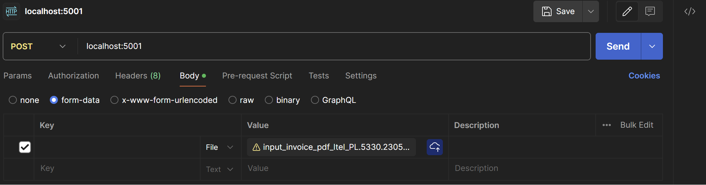

1. pdf_reader contains the server code to host the rest api to receive the pdf file
2. main.ipynb contain the ml model (random Forest) for taining and testing the ML algo for detecting malware in pdf/ run this to recreate models under Models folder
3. Run python pdf_reader.py and a server should come up at http://localhost:5001
4. Upload files using postman 
5. A good pdf will give "valid" as response and a bad one will give "invalid"
